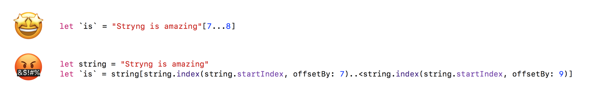

<p align="center"></p>

<p align="center">
    <a href="https://dashboard.buddybuild.com/apps/5a2daf55ed9a900001c6dc1b/build/latest?branch=master">
        
    </a>
    <a href="https://github.com/Carthage/Carthage">
        
    </a>
    <a href="http://cocoapods.org/pods/Stryng">
        
    </a>
    <a href="http://cocoapods.org/pods/Stryng">
        
    </a>
    <a href="https://twitter.com/BalestraPatrick">
        
    </a>
</p>

# Stryng
`Stryng` is designed to make it easier to work with strings by using the common and easy to remember subscript syntax and accessing characters and ranges with `Int` indices.

Swift's strings management is one of the most painful feature of the language. Sure, it's great to have Unicode correctness and efficiency, but this comes at a cost: too much verbosity and complexity.

## Examples

Retrieve a single character at a specific position.

```swift
let string = "Example"
// With Stryng
string[1] // "x"
// Without
string[string.index(string.startIndex, offsetBy: 1)] // "x"
```

Retrieve the substring up to a specific index.

```swift
let string = "Example"
// With Stryng
string[..<2] // "Ex"
// Without
string[..<string.index(string.startIndex, offsetBy: 2)] // "Ex"
```

Retrieve the substring between two indices.

```swift
let string = "Example"
// With Stryng
string[1..<6] // "xampl"
// Without
string[string.index(string.startIndex, offsetBy: 1)..<string.index(string.startIndex, offsetBy: 6)] // "Ex"
```

Retrieve positions of a all substring occurences.

```swift
let string = "Example Example"
let occurences = string["xa"] // Returns a [Range<String.Index>] containing all positions of the subtring.
```

Convert a `Substring` to a `String`.

```swift
let example = "Example"
example[1...5].string // Returns a `String?` instead of a `Substring?`
```

## Usage
This is an up to date list of the supported subscripts. Take a look at [`StryngTests.swift`](https://github.com/BalestraPatrick/Stryng/blob/master/Tests/StryngTests/StryngTests.swift)  if you want to see some more real code examples.

```swift
// String[1]
public subscript(index: Int) -> Character?

// String[0..<1]
public subscript(range: Range<Int>) -> Substring?

// String[0...1]
public subscript(range: ClosedRange<Int>) -> Substring?

// String[..<1]
public subscript(value: PartialRangeUpTo<Int>) -> Substring?

// String[...1]
public subscript(value: PartialRangeThrough<Int>) -> Substring?

// String[1...]
public subscript(value: PartialRangeFrom<Int>) -> Substring?

// String["substring"]
public subscript(string: String) -> [Range<String.Index>]

// String["begin"..."end"]
public subscript(range: ClosedRange<String>) -> [ClosedRange<String.Index>]

// String["begin"..<"end"]
public subscript(range: Range<String>) -> [Range<String.Index>]

// String[Character("a")]
public subscript(character: Character) -> [String.Index]

// String["begin"...]
public subscript(range: PartialRangeFrom<String>) -> PartialRangeFrom<String.Index>?

// String[..."end"]
public subscript(range: PartialRangeThrough<String>) -> PartialRangeThrough<String.Index>?
```

## Disclosure
Yes, string traversal in Swift can be slow. The reason why these subscripts don't exist in the standard library is that some people think that it hides the performance implications of traversing a string. Traversing a string from the `startIndex` until the `endIndex` has complexity O(n). 
If you need to get a character at a specific index, in one way or another you will have to traverse the string, but why would you need 3 lines of code instead of 1 to do that if you know what you're doing?

This is why Stryng is here to help you.

## Contribute
We'd love your help. 
Head over to the [issues](https://github.com/BalestraPatrick/Stryng/issues) with your feedback. 
Bonus points if you open a [Pull request](https://github.com/BalestraPatrick/Stryng/pulls) with a failing test for a bug or a new feature! ⭐️

## Author

I'm [Patrick Balestra](http://www.patrickbalestra.com).

Email: [me@patrickbalestra.com](mailto:me@patrickbalestra.com)

Twitter: [@BalestraPatrick](http://twitter.com/BalestraPatrick).

## License

`Stryng` is available under the MIT license. See the [LICENSE](LICENSE) file for more info.

